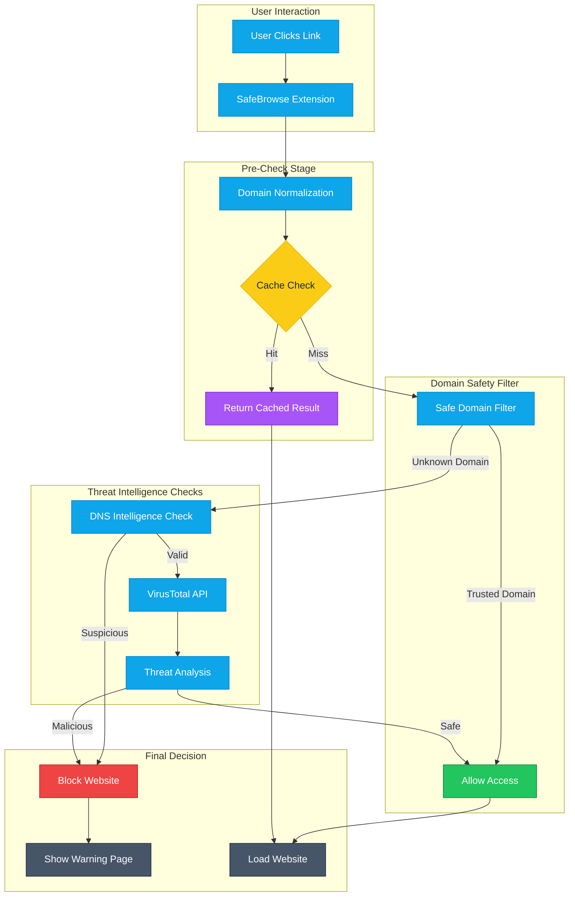

# 🔐 SafeBrowse — Real-Time Browser Security Architecture

## 🌍 Overview

SafeBrowse is a lightweight, privacy-first cybersecurity browser extension designed to protect users from phishing, malware, and malicious websites in real time.

Unlike traditional security solutions that react after a threat is encountered, SafeBrowse implements a **proactive, client-edge detection model** that evaluates domain risk before user interaction occurs.

This approach enables early-stage threat prevention, reducing exposure to phishing attacks, financial fraud, and malicious payload delivery.

## 🔐 SafeBrowse Architecture Diagram

**Architecture Layers**

Intercepts navigation requests

Extracts and normalizes domains

Displays user warnings

Edge Layer (Cloudflare Workers)

Executes globally at low latency

Handles domain evaluation logic

Protects API keys and backend logic

Intelligence Layer

VirusTotal (malware/phishing reputation)

DNS-based intelligence (Quad9-inspired filtering)

Cached threat results

Decision Layer

Applies risk scoring

Determines whether to allow or block access

⚙️ **Detailed Execution Flow**

A user clicks a link or enters a URL

SafeBrowse intercepts the navigation request before page load

The domain is extracted and normalized (e.g., removing www)

A request is sent to a Cloudflare Worker (edge node)

The Worker performs:

Cache lookup (fast response path)

Safe-domain filtering (trusted domains bypass)

DNS intelligence checks (domain validity & heuristics)

VirusTotal analysis (only when necessary)

A verdict is generated:

✅ **Safe → Website loads normally**

🚫 Malicious → Warning page is displayed

🔍 Threat Detection Pipeline
User Request
   ↓
Domain Normalization
   ↓
Cache Lookup
   ↓
DNS Intelligence Layer
   ↓
VirusTotal Analysis (last resort)
   ↓
Risk Evaluation
   ↓
Block or Allow
🛡️ **Security Model**

SafeBrowse follows a Zero Trust security model:

No domain is trusted by default

Every request is evaluated in real time

Decisions are based on live threat intelligence

Key Protections

Phishing detection

Malware domain blocking

Suspicious domain identification

Prevention of user interaction with malicious content

🌐 **Technologies Used**

Cloudflare Workers (Edge Computing)

VirusTotal API (Threat Intelligence)

DNS-over-HTTPS (Cloudflare DNS)

JavaScript (Extension + Backend)

Secure API architecture

⚡** Performance & Scalability**

Edge-based execution (global low latency)

Intelligent caching (reduces API usage)

Lightweight extension (<20KB)

Serverless scaling (handles large user base)

🔒** Privacy & Data Protection**

SafeBrowse is designed with a strict privacy-first principle:

No personal data collection

No browsing history tracking

No user profiling

Only domain-level analysis is performed

All sensitive operations (e.g., API keys) are securely handled within the backend environment.

🌍 **Global Impact & Public Interest**

SafeBrowse was developed to address a critical cybersecurity gap:

While enterprises deploy advanced protection systems, individual users—especially seniors and underserved communities—remain highly vulnerable to phishing and online fraud.

This solution was created as a technology-driven form of giving back, providing accessible cybersecurity protection to populations that may not afford enterprise security tools.

Impact Areas

Reduction in phishing-related financial fraud

Protection of vulnerable internet users

Increased cybersecurity awareness

Strengthening user-level digital resilience globally

**🚀 Innovation Contribution**

SafeBrowse introduces:

A client-edge hybrid security model

Real-time domain evaluation before interaction

Efficient use of multi-layer threat intelligence

Scalable protection without heavy client-side processing

This represents a shift from reactive to preventive browser security architecture.

🔮** Future Vision**

SafeBrowse is evolving toward:

AI-driven phishing detection

Enterprise browser security solutions

Advanced behavioral threat analysis

Global cybersecurity awareness tools

👤** Author***

Richard Kabanda
Fellow | Cybersecurity, Protecting Systems, Data & Digital Infrastructure
